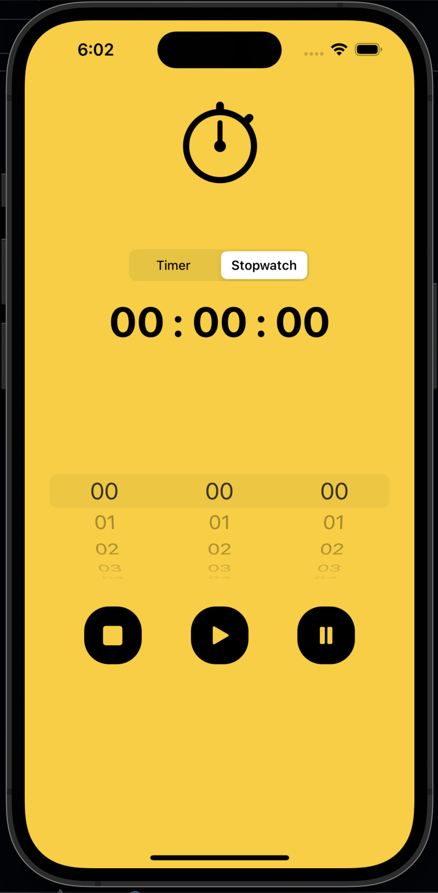

# Neobis_iOS_StopWatch

StopWatch
 

  

   
# Project Overview
 
This is a simple iOS app that allows users to use a stopwatch or a countdown timer. It has a UIPickerView to select the time in hours, minutes, and seconds, and three buttons to control the timer: Play/Start, Stop, and Reset. The app also uses a custom PlayStopButtonSize class to style the buttons.

# Project Structure

The project consists of a single view controller named ViewController. It also includes an extension to the UIImage class to create images with a specified color.

# IBOutlets

1. pickerView: A UIPickerView instance that allows users to select the time for the timer or stopwatch.
2. timeLabel: A UILabel that displays the current time in the format "HH:mm:ss".
3. image: An UIImageView to display either a stopwatch or timer icon depending on the selected mode.
4. segmentControl: A UISegmentedControl to switch between stopwatch and timer modes.
5. playButton, stopButton, pauseButton: Custom PlayStopButtonSize instances that represent buttons to control the timer.
